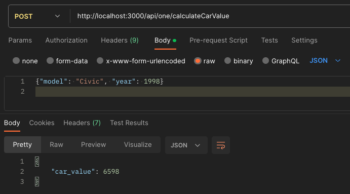
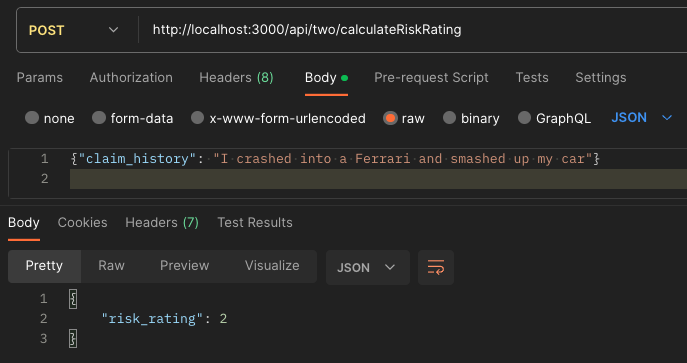
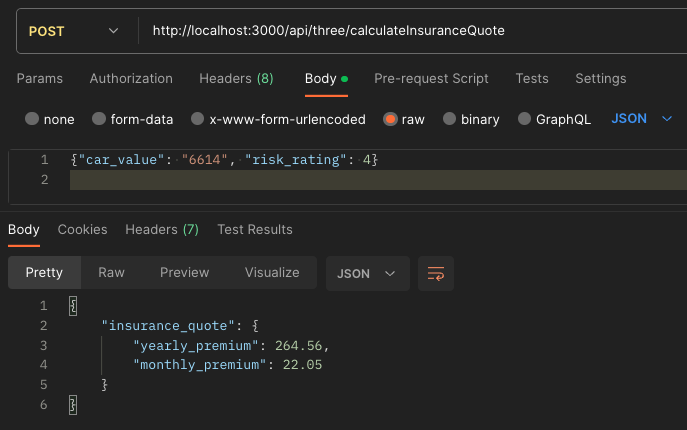

# Mission 1 documentation

Table of Contents

- Project
  - [Overview](#1-project)

- API'S
  - [apiOne](#apiOne)
  - [apiTwo](#apiTwo)
  - [apiThree](#apiThree)

- Testing framworks
    - [Jest](#3-testing-framworks)

- Getting started
    - [Instructions](#4-getting-started)

- [Contribute](#5-contribute)
- [Contact](#6-contact)


## 1. Project
#### *Overview*:

<details>
"Mission 1 required us to step into the role of software developers collaborating with a team of UX designers to address challenges within the insurance quotation process at Turners Car Auctions/Used Vehicle Dealership. The ultimate goal was to deliver an application interface enabling customers to input essential information and promptly receive an insurance quote. This mission introduced us to the principles of Test-Driven Development (TDD), a valuable skill that proved instrumental in anticipating and addressing potential scenarios our program might encounter. By applying TDD, we meticulously mapped out the development of our application, ensuring that it considered various edge cases. To successfully complete the program, we crafted three APIs, functions, and their corresponding tests to guarantee efficiency. Testing frameworks like Jest were employed, leveraging Node.js as the backend runtime environment, and Express.js for our server implementation."
</details>

<p align="right">(<a href="#mission-1-documentation">back to top</a>)</p>

## 2. API's
#### *apiOne*:

<details>

#### Car Value Calculation API

##### *Description:*

apiOne is a Node.js API built with the Express framework to facilitate the calculation of car values based on user-provided information. The API exposes a single endpoint, "/api/one/calculateCarValue", which handles incoming POST requests containing JSON payloads with details about the car model and year.

###### *Features:*

- __Input Validation:__ The API employs robust input validation to ensure data integrity. It checks for non-alphabetic characters in the "model," presence of "model" when "year" is provided, "year" being a numeric value, and valid ranges for the "year" parameter.

- __Error Handling:__ In cases where input validation fails, the API responds with appropriate error messages and a 400 Bad Request status, providing clear feedback to users about the issues in their requests.

- __Modularity:__ The code structure promotes modularity by importing the necessary modules (Express, bodyParser, and the calculateCarValue function) and organizing the functionality in a clear and readable manner.

- __Scalability:__ Built on the widely-used Express framework, apiOne is scalable and can be easily extended to accommodate additional features or integrate with other components of a larger system.

###### *Usage:*

1. __Endpoint:__ /api/one/calculateCarValue
2. __HTTP Method:__ POST
3. __Request Body:__ JSON payload with "model" (alphanumeric) and "year" (numeric) parameters.
4. __Response:__ JSON containing the calculated car value or detailed error messages in case of invalid inputs.

###### *Dependencies:*

1. __Express:__ Fast and minimalist web framework for Node.js.
2. __Body-parser:__ Middleware for handling JSON and URL-encoded request bodies.

###### *Getting started*

1. Install dependencies: __npm install__
2. Run the API: __npm run nodemon__
3. Send POST requests to the __/api/one/calculateCarValue__ endpoint with valid JSON payloads.


###### *Example Usage:*



</details>

#### *apiTwo:*

<details>

#### Risk Rating Calculation API

##### *Description:*

apiTwo is a Node.js API developed using the Express framework to facilitate the calculation of risk ratings based on user-provided information related to claim history. The API exposes a single endpoint, "/api/two/calculateRiskRating", which handles incoming POST requests containing JSON payloads with details about the claim history.

###### *Features:*

- __Input Validation:__ Robust input validation is implemented to ensure the integrity of the provided data. The API checks for invalid characters in the "claim_history" input and ensures that it is not null, undefined, false, or an empty string.

- __Error Handling:__ In cases where input validation fails, the API responds with clear and informative error messages, accompanied by a 400 Bad Request status, providing users with precise feedback regarding issues in their requests.

- __Modularity:__ The code is structured to promote modularity, importing the necessary modules (Express, bodyParser, and the calculateRiskRating function) and organizing the functionality in a clear and readable manner.

- __Scalability:__ Leveraging the Express framework, apiTwo is scalable and adaptable, allowing for potential expansion with additional features or integration into larger systems.

###### *Usage:*

1. __Endpoint:__ /api/two/calculateRiskRating
2. __HTTP Method:__ POST
3. __Request Body:__ JSON payload with "claim_history" parameter.
4. __Response:__ JSON containing the calculated risk rating or detailed error messages in case of invalid inputs.

###### *Dependencies:*

1. __Express:__ Fast and minimalist web framework for Node.js.
2. __Body-parser:__ Middleware for handling JSON and URL-encoded request bodies.

###### *Getting started*

1. Install dependencies: __npm install__
2. Run the API: __npm run nodemon__
3. Send POST requests to the __/api/two/calculateRiskRating__ endpoint with valid JSON payloads.

###### *Example Usage:*



</details>

#### *apiThree:*

<details>

####  Insurance Quote Calculation API

##### *Description:*

apiThree is a Node.js API developed with the Express framework to streamline the calculation of insurance quotes based on user-provided information, specifically car value and risk rating. The API exposes a single endpoint, "/api/three/calculateInsuranceQuote", designed to handle incoming POST requests containing JSON payloads with details about the car value and risk rating.

###### *Features:*

- __Input Parameters:__ The API expects JSON payloads with "car_value" and "risk_rating" parameters, representing key factors for calculating insurance quotes.

- __Input Validation:__ The API relies on the provided parameters for the insurance quote calculation, assuming these parameters are validated elsewhere in the application. Input validation for "car_value" and "risk_rating" is not explicitly implemented in this API, assuming the calculations are based on validated and sanitized inputs.

- __Modularity:__ The code is structured for modularity, importing essential modules (Express, bodyParser, and the calculateInsuranceQuote function) to organize the functionality in a clear 

- __Scalability:__ Utilizing the Express framework, apiThree is scalable and can be easily integrated into larger systems or extended with additional features.

###### *Usage:*

1. __Endpoint:__ /api/three/calculateInsuranceQuote
2. __HTTP Method:__ POST
3. __Request Body:__ JSON payload with "car_value" and "risk_rating" parameters.
4. __Response:__ JSON containing the calculated insurance quote.

###### *Dependencies:*

1. __Express:__ Fast and minimalist web framework for Node.js.
2. __Body-parser:__ Middleware for handling JSON and URL-encoded request bodies.

###### *Getting started*

1. Install dependencies: __npm install__
2. Run the API: __npm run nodemon__
3. Send POST requests to the __/api/three/calculateInsuranceQuote__ endpoint with valid JSON payloads.

###### *Example Usage:*



</details>

<p align="right">(<a href="#mission-1-documentation">back to top</a>)</p>

## 3. Testing framworks

<details>

#### Jest

##### *Description*

Jest is a robust JavaScript testing framework developed by Facebook, designed to streamline and simplify the testing process for JavaScript applications. Widely embraced within the JavaScript community, Jest excels in testing scenarios, particularly for React applications.

##### *Features*

1. __Test Runner:__ Jest comes equipped with a built-in test runner capable of executing entire test suites or individual test cases. Its ability to run tests in parallel contributes to enhanced speed and efficiency.

2. __Assertions and Matchers:__ Simplifying the writing of test cases, Jest provides a comprehensive set of built-in assertions and matchers for common testing scenarios. This ensures a straightforward and expressive testing syntax.

3. __Mocking:__ Jest boasts a robust mocking system, allowing developers to effortlessly mock functions, modules, and dependencies. This capability is instrumental for isolating code during testing and creating controlled testing environments.

4. __Snapshot Testing:__ Leveraging snapshot testing, Jest captures and stores the output of components or functions, enabling developers to detect unexpected changes in the output over time.

5. __Code Coverage:__ Jest can generate detailed code coverage reports, offering insights into which parts of the codebase are covered by tests and which areas may require additional testing.

6. __Asynchronous Testing:__ With built-in support for testing asynchronous code, including promises and callbacks, Jest is well-suited for modern JavaScript applications where asynchronous operations are prevalent.

7. __Watch Mode:__ Jest's watch mode facilitates an efficient development workflow by automatically re-running tests upon detecting changes in the codebase. This feature provides quick feedback during the development process.

</details>

<p align="right">(<a href="#mission-1-documentation">back to top</a>)</p>

## 4. Getting started

#### *instructions*

<details>

1. __Clone the repo__
```
git clone https://github.com/Walks99/Level-5-Mission-1.git
```
2. __Install dependencies__
```
npm install
```
3. __Start the development server__
```
npm run nodemon
```
4. Choose which API to send JSON payloads too
```
/api/one/calculateCarValue
/api/two/calculateRiskRating
api/three/calculateInsuranceQuote
```
</details>

<p align="right">(<a href="#mission-1-documentation">back to top</a>)</p>

## 5. Contribute 

<details>

Contributions are what make the open source community such an amazing place to learn, inspire, and create. Any contributions you make are greatly appreciated.

If you have a suggestion that would make this better, please fork the repo and create a pull request. You can also simply open an issue with the tag "enhancement". Don't forget to give the project a star! Thanks again!

1. Fork the Project
2. Create your Feature Branch (git checkout -b feature/AmazingFeature)
3. Commit your Changes (git commit -m 'Add some AmazingFeature')
4. Push to the Branch (git push origin feature/AmazingFeature)
5. Open a Pull Request

</details>

## 6. Contact 

<details>

- Ben Walker: Ben@missionreadyhq.com
- Project Link: https://github.com/Walks99/Level-5-Mission-1.git

</details>

<p align="right">(<a href="#mission-1-documentation">back to top</a>)</p>


